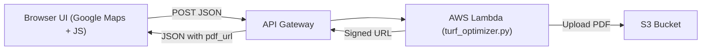

# System Architecture & Workflow

## 1. Overview

The system has two main parts:

1. **Frontend (Browser UI)** – User draws polygons on a Google Maps canvas, picks turf/extras, and gets a JSON payload.
2. **Optimizer (AWS Lambda + Python)** – Parses the JSON, optimizes strip layout, generates a PDF.




---

## 2. Components

### Frontend (metatron.is staff login)

* HTML/CSS/JS page
* Google Maps JavaScript API (geometry, drawing, places)
* Fetches price lists from two Google Sheets CSV exports
* Builds the `{ "body": "<json string>" }` wrapper used by Lambda

### AWS Lambda (Python 3.10)

* Uses a Lambda layer with Shapely, NumPy, Matplotlib
* Calls `generate_turf_layout(data)` in `turf_optimizer.py`
* Uploads PDF bytes to S3 and returns a presigned URL

### Amazon S3

* Bucket: stores PDFs at `turf-layouts/{uuid}.pdf`
* Public access blocked; access via URLs

### CloudWatch

* Logs from Lambda (timings, errors)
* Metrics from API Gateway (2xx/4xx/5xx, latency)
* Optional S3 access logs

---

## 3. End‑to‑end flow (short)

1. User draws polygon and selects materials in browser
2. Browser posts JSON to API Gateway
3. Lambda optimizes layout, generates PDF, puts it in S3
4. Lambda returns `{ "pdf_url": "https://..." }`
5. Browser opens PDF in a new tab

---

## 4. Detailed sequence (expanded 12 steps)

### Page load (frontend)

1. **HTML/CSS/JS download** from metatron.is/staff
2. **Google Maps JS API** loads (geometry, drawing, places) with API key in URL
3. `initMap()` is registered as the callback

### Price‑list bootstrap

4. Two CSVs (grass & extras) are fetched from Google Sheets (anonymous links)
5. `csvToArray()` converts CSV → arrays and drops header row
6. `grassMap` & `extraMap` objects are filled; UI controls are populated

### Map initialisation

7. `initMap()` executes once Maps code is ready
8. Map renders; Places autocomplete wired
9. `DrawingManager` is created; only polygon tool enabled
10. Drawing controls appear bottom‑centre

### User interaction

11. User picks turf type and extras; Sandur, Lim, Limbordi (e. Sand, Glue, Glue Tape)
12. User draws a polygon; vertices are captured

### Geometry & cost calculator (browser)

13. `overlaycomplete` fires; Maps Geometry library returns:

 * Area (m²)
 * Vertex list (lat/lng)
 * Side lengths (m)
14. Script looks up prices, builds `extras_detail`, computes sand kg & cost
15. JSON object is built (example below) and pretty‑printed into `<pre id="shape-info">`

```jsonc
{
 "grass_type": "...",
 "grass_width_m": 4,
 "roll_width": 4,
 "grass_price_isk_per_m2": 4177,
 "extras_selected": [...],
 "extras_detail": [...],
 "sand_rate_kg_per_m2": 10,
 "sand_total_kg": 402.78,
 "sand_total_cost_isk": 44306,
 "area_m2": 40.28,
 "vertices": [{ "lat": 64.1, "lng": -21.9 }, ...],
 "side_lengths_m": [...]
}
```

### HTTP request to backend

16. Browser does `fetch(endpoint, { method: 'POST', body: JSON.stringify(result) })`
17. CORS preflight (OPTIONS) to API Gateway → response allows origin/headers
18. Browser sends real POST; payload is the JSON body

### API Gateway → Lambda

19. Stage `prod` receives POST and forwards to Lambda (payload v2)

### Lambda cold start (if needed)

20. Python 3.10 runtime spins up, attaches deps layer
21. Imports succeed: `import shapely, numpy, matplotlib, turf_optimizer`

### Lambda handler

22. Reads `event["body"]` → JSON → `data` dict
23. Calls `generate_turf_layout(data)`:

 * Projects lat/lng → metres (flat coords)
 * Searches rotations & offsets to minimize waste
 * Draws layout & cost tables with Matplotlib
 * Writes PDF pages to a `BytesIO` buffer
24. Uploads PDF to S3 bucket `$PDF_BUCKET`
25. Generates presigned URL (e.g., 24h TTL)
26. Returns Lambda response:

```json
{
 "statusCode": 200,
 "headers": {
 "Access-Control-Allow-Origin": "https://metatron.is",
 "Access-Control-Allow-Headers": "Content-Type"
 },
 "body": "{\"pdf_url\":\"https://s3....amazonaws.com/.../uuid.pdf?X-Amz-SignedHeaders=...\"}"
}
```

### API Gateway → Browser

27. API Gateway returns headers + body to browser; CORS lets JS read it

### Frontend receives response

28. `fetch(...).then(r => r.json())` → `{ pdf_url: "https://..." }`
29. Browser runs `window.open(pdf_url, "_blank")` (or shows a link)

### User sees result

30. PDF opens: strip layout, waste, side lengths, cost analysis, Pareto summary

### Logging / Monitoring

31. CloudWatch logs Lambda prints (versions, debug info)
32. API Gateway metrics show traffic, latency, CORS
33. Optional: S3 access logs for PDF downloads
